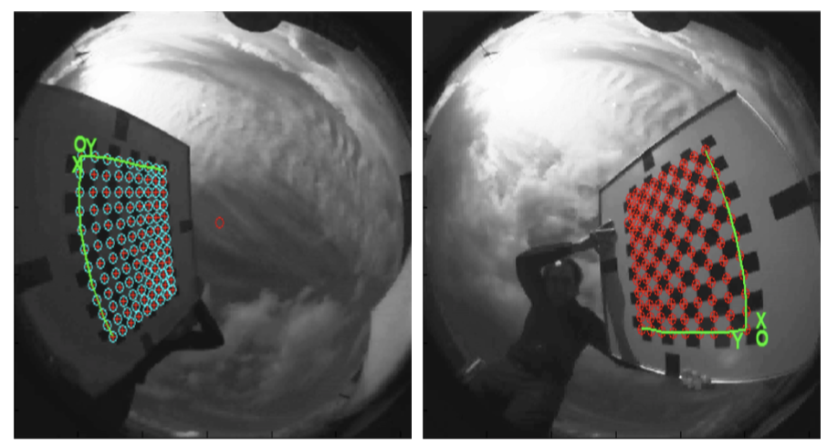
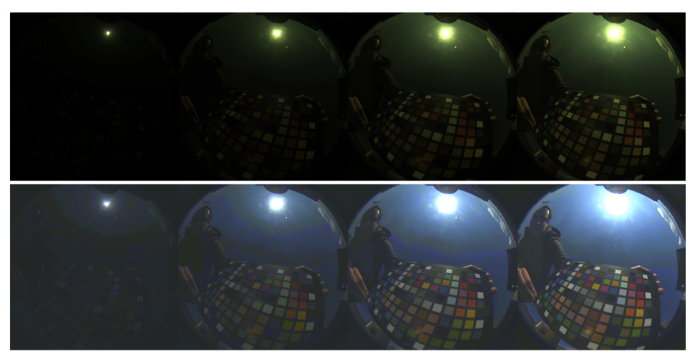

* * *

## News

2019/2/8 Web Site is updated. Link to the Deep Photovoltaic Nowcasting project web page was added.

2019/2/7 Web Site is updated. Sample data and scrips are added. Addition location information and images illustrating the camera and color calibration were also added.

2019/2/6 Web Site is updated. Example videos and location information was added. Hosting was changed.

2019/2/4 Web Site is updated. Data and code for color and camera calibration is added.

2018/10/20 Web Site is updated. General and detailed descriptions is added.

2018/10/10 Web Site is created.

* * *

## Overview

This webpage describes a dataset designed i
+ to study hemispherical sky images captured at a temporal frequency of 1fps, and 
+ to design systems (based on sky images) that can predict photovoltaic the power generation in a time scale of seconds or minutes.

* * *

## Publications and presentations

This dataset was used in the following works. In case you use this data for your research, please cite them.

### Deep photovoltaic nowcasting, @ Solar Energy Journal

Project [webpage](http://vision.gel.ulaval.ca/~jflalonde/projects/deepNowcasting/index.html)

[[Publisher web site](http://www.sciencedirect.com/science/article/pii/S0038092X1831003X)] [[arXiv pre-print](https://arxiv.org/abs/1810.06327)]

Jinsong Zhang, [Rodrigo Verschae](https://rodrigo.verschae.org), [Shohei Nobuhara](https://shohei.nobuhara.org/index.en.html), [Jean-Francois Lalonde](http://www.jflalonde.ca/), 
Deep photovoltaic nowcasting, 
Solar Energy, Volume 176, 2018, Pages 267-276,
ISSN 0038-092X, [https://doi.org/10.1016/j.solener.2018.10.024](https://doi.org/10.1016/j.solener.2018.10.024).

      @article{ZHANG2018267,
      title = "Deep photovoltaic nowcasting",
      journal = "Solar Energy",
      volume = "176",
      pages = "267 - 276",
      year = "2018",
      issn = "0038-092X",
      doi = "https://doi.org/10.1016/j.solener.2018.10.024",
      url = "http://www.sciencedirect.com/science/article/pii/S0038092X1831003X",
      author = "Jinsong Zhang and Rodrigo Verschae and Shohei Nobuhara and Jean-Francois Lalonde",
      keywords = "Short term forecast, Deep learning, Neural networks, Computer vision"
      }

      Keywords: Short term forecast; Deep learning; Neural networks; Computer vision

### A Sky Image Analysis System for Sub-minute PV Prediction @ PVSC 2017

[https://ieeexplore.ieee.org/document/8366340](https://ieeexplore.ieee.org/document/8366340)

      @INPROCEEDINGS{verschaePVSC2017, 
      author={Rodrigo Verschae and Li Li and Shohei Nobuhara and Takekazu Kato}, 
      booktitle={2017 IEEE 44th Photovoltaic Specialist Conference (PVSC)}, 
      title={A Sky Image Analysis System for Sub-minute PV Prediction}, 
      year={2017}, 
      pages={1175-1180}, 
      month={June},
      }

### Daytime Sky Image Model and Prediction @ MIRU 2017

    Rodrigo Verschae, Li Li, Shohei Nobuhara, Takekazu Kato,
    "Daytime Sky Image Model and Prediction",
    20th Meeting on Image Recognition and Understanding, 2017, Hiroshima, Japan

* * *

## Capture System

We use a custom designed camera system to capture hemispherical images of the sky every second. In addtition to the imagenes, every second we also capture the power generate by a photovoltaic (PV) system located near the camera. Both, images and PV data, are timestamped with clocks that are syncronized using NTP servers with errors under 50ms.

### Hardware

The hardware of the sky image capture system consists of: 
   i) a CM3-U3-31S4C Chameleon3 PointGrey Camera (Sony IMX265, 1/1.8", Color, 2048x1536 (3.2MP), USB3), 
   ii) a Spacecom TV1634M, F1.4, 180 degrees Fish-eye lens, and 
   iii) an Intel i7, 8 cores, 4 GHz, 32GB RAM PC (running Ubuntu).

### Software

The system captures multiple exposures at a high speed (8 fps). The capture program is implemented in C++ and uses multi-threading to improve throughput and reduce I/O blocking. The images are cropped in camera (1280x1280 pixels) and captured using a bracketing mode that iterates over 4 shutter speeds (exposure times in {1, 8, 16, 24} x 11ms, see Fig. 3). In order to reduce cloud movement within a bracket, every second only the first 4 frames (out of the 8 captured frames) are kept. These 4 frames are stored and combined to obtain a High Dynamic Range (HDR) image every second.

The following images show: 
+ (left) the capture system, and 
+ (right) four exposures captured using the bracking mode (with exposures time {1, 8, 16, 24} x 11ms):

* * *

## Request access to the dataset

The part of the data can be made available for research purposes. Please note that the amount of data available is quite large (several months of data), with one day corresponding to up 1000 mb, so we can not share all of it. 
If you interested in using this dataset for research, contact us at through the following [form](https://goo.gl/forms/F7ZbiluHGiFIjKUR2). Below you can find a sample of the data set.

In case you any use this data for your research, please cite the works (Verschae 2017) (Zhang 2018) listed below.

* * *

## Data Sample and Scripts

Data for 20161210: [Here](https://drive.google.com/file/d/1aBhp56iy4o3LbQ3L8q5NIIJVcSJz0vAJ/view?usp=sharing) you can find the data for 20161210 (2016, December, 10th). It includes the videos as well as the time stamps of the captured images and exposures (see the file capture_20161210.csv.gz) and the corresponding captured PV info (see file PV.csv). The file [20161210_CSV.zip](files/data/20161210_CSV.zip) contains the already aligned PV and image data for every 10min, assuming the script extract.sh (see below) was used to extract the frame from the videos.

Data for 20161209: [Here](https://drive.google.com/file/d/1aBhp56iy4o3LbQ3L8q5NIIJVcSJz0vAJ/view?usp=sharing
) you can find the data for 20161209 (2016, December, 9th). It includes the videos as well as the time stamps of the captured images and exposures (see the file capture_20161209.csv.gz) and the corresponding captured PV info (see file PV.csv). The file [20161209_CSV.zip](files/data/20161209_CSV.zip) contains the already aligned PV and image data for every 10min, assuming the script extract.sh (see below) was used to extract the frame from the videos.

To extract the images from the videos you can use the script [extract.sh](files/data/extract.sh). 

The files [README.txt](files/data/README.txt) and [README_CSV.txt](files/data/README_CSV.txt) contained  descriptions of the format of the files and the use of scripts.

* * *

## Example videos

Below you can see some videos with a few representative examples of the captured data. Each video corresponds to 10 minutes of data captured every second (i.e there are 600 frames in the video, each one corresponding to the data capture every second). Note that each frame contains the four exposures captured every second that can be used for obtaining a high dynamic range image that allows to have detailed cloud information and part of the sun intensity (capturing the complete dynamic range of the sun would require many more exposures or an especialized camera).

Partly Cloudy day (10 min):
<iframe width="560" height="315" src="https://www.youtube.com/embed/_pxHIIGRekw" frameborder="0" allow="accelerometer; autoplay; encrypted-media; gyroscope; picture-in-picture" allowfullscreen></iframe>

Sunny day (10 min):
<iframe width="560" height="315" src="https://www.youtube.com/embed/YCKLs9SlzYo" frameborder="0" allow="accelerometer; autoplay; encrypted-media; gyroscope; picture-in-picture" allowfullscreen></iframe>

 More videos at (view or download these videos from [google drive](https://drive.google.com/drive/folders/1iP02G0AodjJjz_z1XQ188bgCi5li3GTa?usp=sharing)):
+ [youtube](https://youtu.be/QV_2ckAekNg) | [mp4](files/videos/cloudy20161209-100.mp4)
+ [youtube](https://youtu.be/CKtiB95CUS4) | [mp4](files/videos/cloudy20161209-112.mp4)
+ [youtube](https://youtu.be/C8UmAqc44qk) | [mp4](files/videos/cloudy20161211-092.mp4)
+ [youtube](https://youtu.be/8J3r2HjovSY) | [mp4](files/videos/dark20161209-084.mp4)
+ [youtube](https://youtu.be/1_ZUq5zZJQ4) | [mp4](files/videos/movefromsun20161210-105.mp4)
+ [youtube](https://youtu.be/_pxHIIGRekw) | [mp4](files/videos/movetofromsun20161211-140.mp4)
+ [youtube](https://youtu.be/zygS1p3gmV0) | [mp4](files/videos/movetosun20161211-103.mp4)
+ [youtube](https://youtu.be/YCKLs9SlzYo) | [mp4](files/videos/sunny20161210-111.mp4)
+ [youtube](https://youtu.be/DHf-eVOYgq8) | [mp4](files/videos/varyfast20161210-112.mp4)

* * *

## Calibration

### Camera model calibration

+ The camera parameters were calibrated using [ocamcalib toolbox](https://sites.google.com/site/scarabotix/ocamcalib-toolbox).
+ The camera parameters can be found in the files [calib_results.txt](http://rodrigo.verschae.org/skyPvCapture/files/calib_results.txt) and [Omni_Calib_Results.mat](files/Omni_Calib_Results.mat). 
+ The images used for calibration are in the file [fisheyelens_calib.zip](http://rodrigo.verschae.org/skyPvCapture/files/fisheyelens_calib.zip)
+ Matlab code for the projection to the Sky plane and for backprojection can be found [Here](http://rodrigo.verschae.org/skyPvCapture/files/cameraCalibration.zip).
The functions backproject.m and undistort_rgb.m do the main work, and the other two functions (backprojection.m and cam2worldplane.m) apply these functions to a set of images.

### Color Calibration

A simple color calibration model was used for the images based on a standard color checker. The data, procedure and code can be found in [colorCalibration.zip](http://rodrigo.verschae.org/skyPvCapture/files/colorCalibration.zip). This includes the calibration model and parameters calibColor.m, the code used for calibration calibrate.m and image used for calibration frame-431.jpg. See the file ColorCalibrationV0_20170417.pdf for description.

* * *

## Location

The data was captured in the Yoshida Campus of Kyoto University, Kyoto, Japan ([location on google maps: 35.0272731,135.782756](https://www.google.com/maps/@35.0272731,135.782756,98m/data=!3m1!1e3)). 

The following image shows a 360 capture of the location where the camera capture system is installed and ([here](https://youtu.be/FIy425imJus) you can find a video of the same location.)

The camera is located about 80 meters from the photovoltaic capturing system:

* * *

## Acknowledgement

This work was partially supported by the JSPS Kakenhi grant 17H01922 and the Smart Energy Management Research Unit, Kyoto University, Japan.

<!-- Start of StatCounter Code -->

<noscript> </noscript>

<!-- End of StatCounter Code -->  

